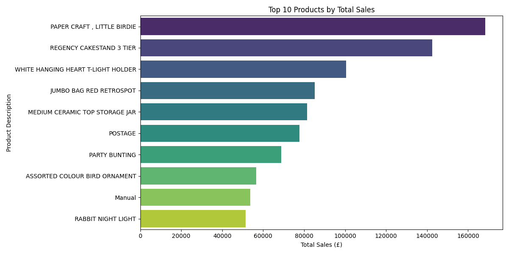
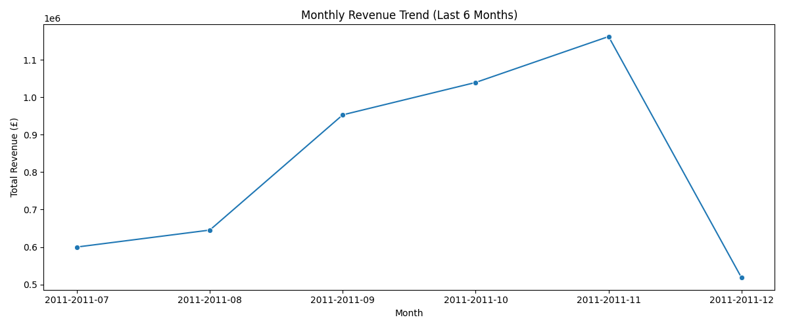
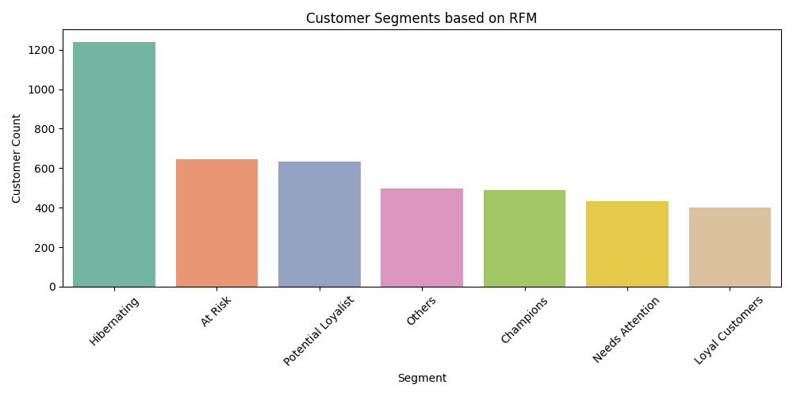

# 🛍️ Retail Analytics Data Pipeline + Streamlit Dashboard (Medallion Architecture)

[](https://streamlit.io)
[]

An end-to-end retail analytics pipeline using Medallion Architecture (Bronze → Silver → Gold), enhanced with a **Streamlit dashboard** for interactive insights and visualization.

---

## 🔧 Tech Stack

- **Python** (Pandas, NumPy)
- **MySQL** for gold-layer storage
- **Seaborn / Matplotlib** for visualization
- **Medallion Architecture**: Bronze → Silver → Gold
- **SQLAlchemy** for database connection
- **Jupyter Notebook** for EDA & Insights

---

## ✨ Features

- Full ETL using **Python, Pandas, MySQL, PySpark**
- Cloud-ready structure using Medallion Architecture
- Interactive **Streamlit app** with:
  - Dynamic **Key Metrics** (Revenue, Orders, Customers) filtered by country & date
  - **Revenue Trend** and **Top Products** visuals
  - **RFM-based customer segmentation**
  - **Top Customers** listing
  - **Country-wise customer distribution**
  - Expanders for dataset exploration and filtering

## 📁 Folder Structure
retail-analytics-pipeline/
├── data/ # Raw to processed data
├── scripts/ # Master ETL Scripts
├── utils/ # Cleaning and Transformation Script
├── notebooks/ # EDA and visual insights
├── requirements.txt
├── README.md
└── .gitignore

---

## 🧱 Medallion Architecture Overview

- **Bronze**: Raw data from UCI & Faker-generated customer/inventory
- **Silver**: Cleaned and validated data (email, phone, signup date, product info)
- **Gold**: Enriched data with RFM segmentation, monthly sales, country-wise analysis

---

## 📊 Business Insights

1. 📦 **Top 10 Products by Sales**  
2. 📈 **Monthly Revenue Trends** (last 6 months)  
3. 🌍 **Top Countries by Avg Order Value**  
4. 🇳🇴 **Norway’s Favorite Products**  
5. 👥 **Customer Segments using RFM**

All visualizations and insights are available in the notebook:  
📒 [`notebooks/retail_eda_and_insights.ipynb`](notebooks/retail_eda_and_insights.ipynb)

---

## 🧠 Customer Segmentation (RFM)

- **Champions**: Recent, frequent, high spenders
- **Loyal Customers**
- **At Risk**
- **Hibernating**
- And more...

RFM scores are calculated, combined, and used to assign meaningful segments.

---

## 🚀 How to Run

1. Clone the repo:
```bash
git clone https://github.com/yourusername/retail-analytics-pipeline.git

2. Create a virtual environment and install dependencies:

pip install -r requirements.txt

3. Launch app
streamlit run streamlit_app.py

4. Run ETL pipeline:

python scripts/etl_pipeline.py

5. Open Jupyter Notebook for insights:

jupyter notebook notebooks/retail_eda_and_insights.ipynb

6. Insights Section
```markdown
## 📊 Dashboard Insights

1. **Key Metrics**: Revenue, Orders, Customers for filtered timeframe  
2. **Monthly Revenue Trend** chart  
3. **Top 10 Products** bar chart  
4. **Customer Segmentation** via RFM (Champions, Loyal, etc.)  
5. **Top 10 Customers** by spending  
6. **Country Distribution** of unique customers 

📷 Sample Visualizations
### 🥇 Top 10 Products by Total Sales


### 📈 Monthly Revenue Trend


### 👥 Customer Segmentation (RFM)


🙋‍♀️ About the Author
Built with ❤️ by Payal Goyal, an aspiring Data Engineer passionate about building production-grade analytics pipelines.

📌 License
This project is for educational purposes.
